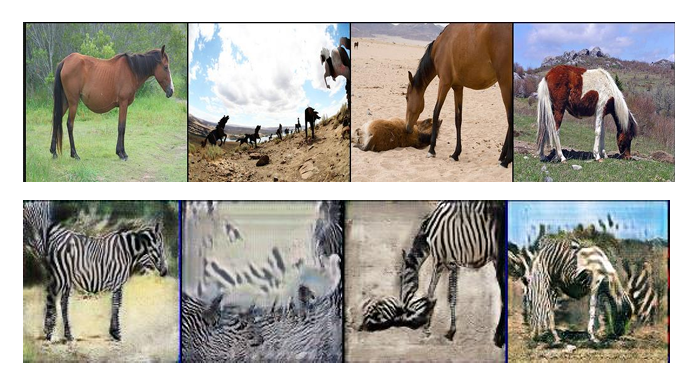

## Unpaired Image-to-Image Translation using Cycle-Consistent Adversarial Networks
**기간: 2025.07.14 ~2025.07.16**

1.	논문 읽기
2.	모델 구현
3.	실험
   
**논문 주요 내용**  
기존의 이미지-이미지 변환 (Image-to-Image Translation) 모델들은 쌍으로 된 데이터가 필요했지만, 실제로는 이런 짝 데이터 수집이 어렵거나 불가능한 경우가 많음.CycleGAN은 이런 문제를 해결하기 위해 쌍이 없는 이미지들만으로도 스타일 변환이 가능하도록 제안됨.
두개의  Generator, Discriminator가 필요하며 Loss는 GAN Loss와 Cycle Consistency Loss로 이루어져 있음. Cycle Consistency loss는 원래 도메인으로 되돌릴 수 있어야 한다는 제약 조건을 추가하기 위해 존재

**알게 된 개념**  
1. GAN에서 Generator와 Discriminator의 학습 구조
   

실험 결과 고해상도 이미지 변환에는 한계가 있음

